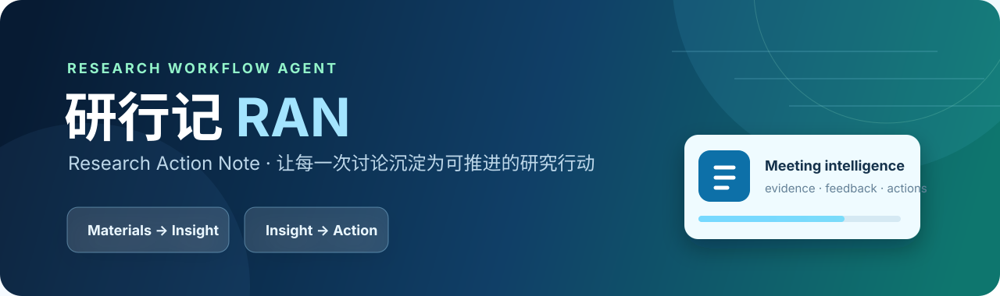

<div align="center">
  

  <br />

  English · [中文](README.md)

  <p><strong>From multimodal meeting materials to traceable research actions.</strong></p>
  <p>A research-meeting workflow agent that turns transcripts, slides, papers, and discussions into structured notes, reviewable evidence, and cross-meeting action loops.</p>

  
  
  
  
</div>

---

## Why RAN

Research-meeting value is often scattered across transcripts, slide decks, papers, and informal discussion. RAN (**R**esearch **A**ction **N**ote) organizes these inputs into a reviewable workflow: identify sources, extract decisions, create action items, and carry unresolved work into the next meeting.

> **Product thesis**: a meeting is not a one-off summary; it is a research asset that can be searched, tracked, and advanced.

## Capabilities

| From input to delivery | Capability |
| :-- | :-- |
| **Multimodal intake** | Handles transcripts, DOCX, PPT/PPTX, and PDF files; speech transcripts can be cleaned while retaining a human review step. |
| **Structured meeting notes** | Produces reporter/topic-oriented summaries, advisor feedback, risks, and next actions. |
| **Traceable evidence** | Associates important findings with imported material instead of presenting unsupported summaries. |
| **Action-item loop** | Tracks owner, due date, priority, status, and response; items remain editable. |
| **Cross-meeting memory** | Includes a local library, search, calendar heatmap, and open-action view. |
| **One-click demo** | Ships with a full "Pig Cycle" research-meeting case for an end-to-end walkthrough. |

## Agent workflow

```text
PPT / PDF / DOCX / transcript
              ↓
  parse, clean, and confirm inputs
              ↓
 constrained LLM reasoning and output
              ↓
notes · feedback · risks · actions · evidence
              ↓
local library · cross-meeting tracking · export
```

RAN uses an LLM inside a controlled product workflow. The model interprets and synthesizes; the application owns parsing, field constraints, file archiving, action status, and retrieval. This keeps the flexibility of natural language while making outputs reviewable, editable, and actionable.

## Quick start

### macOS: double-click launch (recommended for demos)

1. Configure a model service in `ran-backend/.env`; use `ran-backend/.env.example` as a template.
2. Double-click [启动研行记.command](启动研行记.command) in Finder.
3. On the first run, Python dependencies are installed automatically and the browser opens when the service is ready.
4. Select “立即试用” to load the bundled case and generate an end-to-end meeting note.

Keep the launch terminal open while using the app; closing it stops the local service.

### Manual launch

```bash
cd ran-backend
python3 -m venv .venv
./.venv/bin/python -m pip install -r requirements.txt
./.venv/bin/python -m uvicorn main:app --host 127.0.0.1 --port 8003
```

In a second terminal:

```bash
cd "ran-page 3"
python3 -m http.server 8081
```

Open `http://127.0.0.1:8081`.

## Configuration

```dotenv
OPENAI_API_KEY=your_key
OPENAI_BASE_URL=https://api.openai.com/v1
OPENAI_MODEL=gpt-4o
```

OpenAI-compatible providers are supported. See [模型推荐.md](ran-backend/模型推荐.md) for model notes.

## Repository map

```text
ran-notes/
├── ran-page 3/             # Product landing page and interactive demo
├── ran-backend/
│   ├── main.py             # FastAPI, parsing, LLM orchestration, library APIs
│   ├── trial_assets/       # Bundled demo material
│   ├── requirements.txt    # Python dependencies
│   └── .env.example        # Configuration template
├── 测试材料_三人组会/        # Manual upload test package
└── 启动研行记.command       # One-click macOS launcher
```

## Privacy & boundaries

- API keys are read only from local `.env` files and are excluded from Git.
- Generated notes and uploaded materials stay in the local library and are excluded from Git.
- RAN assists research organization; it does not replace human validation of experiments, data, citations, or conclusions.
- Bundled materials are for product demonstration only. Ensure that you have permission before processing or sharing your own materials.

## Roadmap

- [x] Multi-source parsing and structured notes
- [x] Action-item loop and local research library
- [x] Bundled one-click demo
- [ ] Fine-grained citation references and evidence editing
- [ ] Team collaboration and permissions
- [ ] Deployable multi-user version

## License

Released under the [MIT License](LICENSE).

## Contact

Built by [@maxwell-sw](https://github.com/maxwell-sw). Issues and pull requests are welcome.
